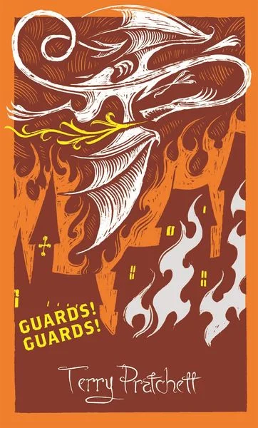

# Janeks Wunschzettel

Hier schreibt Janek alle seine (verrückten) Wünsche auf.

## Allgemeines

- Geld kann man immer gebrauchen
- Gutscheine für Dictum, Spielkultur, Uniqlo oder IKEA kann ich auch immer gebrauchen
- Ich freue mich immer über interessanten Kaffee (Ganze Bohne, für Espresso)

## Kleidung
  
- Classic/Light Merino Wool Crewneck von Colorful Standard in dunkler, gedeckter Farbe zb Navy, Dunkelgrün oder Anthrazit (Größe S)
- Stutterheim Stockholm Lightweight Raincoat Green (vermutlich Größe M, evtl. auch S)
- Schicke Handschuhe in Grau, Schwarz oder Navy

## Küche

- ESGE Zauberstab P 350 Profi
- Staub Cocotte, rund &#x2300; 26cm, schwarz
- Demeyere Edelstahl Bratpfanne Multiline 7 / Industry 5, &#x2300; 24cm
- Demeyere Apollo 7 Sauteuse, konisch, &#x2300; 22 oder 24 cm

## Bücher

- Terry Pratchett - englischsprachige Hardcoverversion (Discworld Collectors Library Edition) mittlerweile auch bei Thalia erhältlich
  

  
Zum Beispiel folgende Bände

    
  - [Guards! Guards!](https://www.thalia.de/shop/home/artikeldetails/A1032518290)
  - [Men at Arms](https://www.thalia.de/shop/home/artikeldetails/A1032518364#serien-slider)
  - [Feet of Clay](https://www.thalia.de/shop/home/artikeldetails/A1033032712)
  - [Jingo](https://www.thalia.de/shop/home/artikeldetails/A1033032767)
  - [Sourcery](https://www.thalia.de/shop/home/artikeldetails/A1032496887)

    Cover sollten in folgendem Stil sein und ein wenig wie aus Stoff wirken

    
    
  

- Enter Shikari
  - Dear Future Historians
  - A Treatise on Possibility
  - Standing Like Statues
- The Complete Japanese Joinery

## Schallplatten

- Unleash The Archers (Nur im Napalm Records Store)
  - Apex
- Red Hot Chilli Peppers
  - I'm With You
- Heaven Shall Burn
  - Veto
  - Heimat
- Enter Shikari
  - The Mindsweep
  - A Flash Flood of Colour
- Trivium
  - The Sin And The Sentence
  - Vengeance Falls
- Rise Against
  - Long Forgotten Songs
  - Ricochet
 
## Technikkram oder so

- BluRay-Player oder (internes) -Laufwerk (gerne 4k UHD fähig)
- Homematic IP Heizkörperthermostat Basic (1x)
- Homematic Tür- und Fensterkontakt (4x)

## Werkzeug & Ähnliches

- Wabeco Bohrständer BF1243 mit 3-Speichen-Drehkreuz Z-Achse ([Wabeco](https://www.wabeco-remscheid.de/catalog/product/view/id/2166/s/bohrstander-frasstander-bf1243-3sd/category/591/), [Amazon](https://www.amazon.de/WABECO-Bohrst%C3%A4nder-Fr%C3%A4sst%C3%A4nder-vertikal-horizontal/dp/B0BN49G1C3/ref=sr_1_3?__mk_de_DE=%C3%85M%C3%85%C5%BD%C3%95%C3%91&crid=36BVPUMYHB5S7&dib=eyJ2IjoiMSJ9.WTx3p1WLOuf6HoT4Pfyqkhq-BR1k40NS3KbYSCqQ1PQu6ou8DrDZTqDzEvlmjcLfk9Ep5pUUPlttKa7o13Lk1L-sp31ACPfulnUI-zeJbQPhsgtv1aIO1mzL7C8ooZE8O03m8pUXG2jKaCLenFiSVAvcstv_qh5d7hc9rIwF83zDrgX9pWKdvhkDU_xRFRjvHmuGdSF321zOCq0JBTrJieLERyfZv4ulDhA5LZPOn1A.B4Asxy3q5jLuaStDzLHqLWsKymnsXFagjlGtx_Cakp0&dib_tag=se&keywords=wabeco+bf1243+3sd&qid=1755372264&sprefix=wabeco+bf1243+3sd%2Caps%2C113&sr=8-3&ufe=app_do%3Aamzn1.fos.897f7637-cfe4-44bf-9f94-1525e7bc9c76))
  - Bosch Professional Schlagbohrmaschine GSB 21-2 RCT ([Amazon](https://www.amazon.de/gp/product/B002L4104I/ref=as_li_tl?ie=UTF8&camp=1638&creative=6742&creativeASIN=B002L4104I&linkCode=as2&tag=5gerade-21&linkId=47b38787b618e314ebf2087ced248079&th=1))

- Hobellade von [Bau Woodworks](https://bau-woodworks.com/produkt/multifunktions-hobellade-mfh/)

- Japansäge Kataba (z.B. [Z-Saw](https://www.dictum.com/de/japansaegen-baaa/z-saw-kataba-250-laengs-712817?number=712817))
- Japansäge Azebiki (z.B. [Z-Saw](https://www.dictum.com/de/japansaegen-baaa/azebiki-saege-90-712247?number=712247))
- Japanische Stemmeisen Oire Nomi Kashi in den Breiten 18mm, 24mm ([Dictum](https://www.dictum.com/de/japanische-form-baba/oire-nomi-kashi-stemmeisen-blattbreite-12-mm-710323))

- Westliche Holzhobel gerne auch alte, gebrauchte
  - Putzhobel
  - Schrubbhobel
  - Raubank
  - Simshobel
  - Nuthobel
  - Falzhobel

- Einhandzwingen von Piher
- Korpuszwingen von Piher

- Eig eher Projekt als Werkzeug: Kumiko Kit von [Bau Woodworks](https://bau-woodworks.com/produkt-kategorie/kumiko-kits-de/)

- Bosch 18V Pro-Core Akku mit mindestens 5,5Ah

## Das ist schon in Erfüllung gegangen
### (ein großen Dank an die vielen lieben Menschen)

- <del>Marmor-Teigrolle</del>
- <del>Hand-Espresso-Presse</del>
- <del>Doppelofenhandschuh</del>
- <del>Graef Kaffeemühle CM 800</del>
- <del>Induktions- und Ofengeeignete Schmorrpfanne (z.B. WMF SELECTit! Servierschmorpfanne mit Deckel, Ø 28 cm)</del>
- <del>Bosch MUZ5NV1 Pastavorsatz Lasagne</del>
- <del>4x Kallax-Türeinsatz (weiß)</del>
- <del>Kallax Einsatz mit 2 Schubladen (die weißen ohne Türknauf)</del>
- <del>Herren Smartwatch "The Carlyle Hr" 5. Generation Silikon Schwarz/Leder Braun</del>
- <del>Teufel Move BT</del>
- <del>Why Nations Fail</del>
- <del>Just a French Guy Cooking von Alexis Gabriel Ainouz (in Englisch)</del>
- <del>Rise Against - Career 8-Disc Box Collection</del>
- <del>Volbeat - Rock The Rebel/Metal The Devil</del>
- <del>Parkway Drive - Ire </del>
- <del>Linkin Park - Hybrid Theorie</del>
- <del>Linkin Park - Minutes To Midnight</del>
- <del>Feine Sahne Fischfilet - Sturm & Dreck</del>
- <del>Feine Sahne Fischfilet - Bleiben oder gehen</del>
- <del>Feine Sahne Fischfilet - Scheitern und Verstehen</del>
- <del>Heaven Shall Burn - Iconoclast</del>
- <del>Trivium - In Waves (gerne colored)</del>
- <del>Emil Bulls - Kill your Demons</del>
- <del>Depeche Mode - Violator</del>
- <del>System Of A Down - Toxicity</del>
- <del>System Of A Down - Mezmerize</del>
- <del>Bosch GST 12v (am liebsten in L-Boxx)</del>
- <del>Hammer</del>
- <del>Schraubenzieher</del>
- <del>Flachzange</del>
- <del>Wasserwaage</del>
- <del>Sortimentkasten Schrauben & Dübel</del>
- <del>Laser-Entfernungsmesser</del>
- <del>Sortimentkasten Nägel</del>
- <del>Kleine Schraubenzieher / Präzisionsschraubenzieher</del>
- <del>SainSmart TS80P Lötkolbern</del>
- <del>Ikea 365+ Behälter, rechteckig, Glas, 1L + Bambus-Deckel</del>
- <del>Red Hot Chilli Peppers - By The Way</del>
- <del>Red Hot Chilli Peppers - The Getaway</del>
- <del>System Of A Down - Steal this Album</del>
- <del>System Of A Down - Hypnotize</del>
- <del>Volbeat - Guitar Gangsters & Cadillac Blood</del>
- <del>Bosch GKT 18V-52 GC PROFESSIONAL Tauchkreissäge</del>
- <del>Stanley Kleinteilemagazin 30 Schubladen (nur kleine Schubladen)</del>
